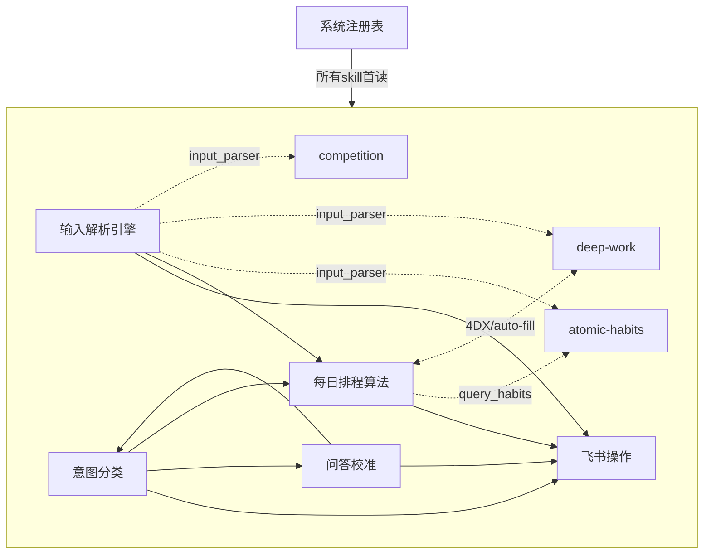

# 个人混合管理系统 · Skill 清单与依赖关系

> 生成日期：2026-07-23
> 范围：`D:\个人混合管理系统\.workbuddy\skills\` 下用户创建的全部 skill
> 配套图：`skills-dependency-graph.svg`

---

## 一、Skill 总清单（共 10 个 + 2 个外部引用）

分四层：**注册表（Hub）→ 入口路由 → 处理层 → 领域模块**。

| # | Skill 名 | 路径 | 层 | 触发方式 |
|---|---------|------|----|---------|
| 1 | 系统注册表（根 SKILL.md） | `SKILL.md` | Hub | 所有 skill 启动时首读 |
| 2 | 输入解析引擎 | `输入解析引擎/SKILL.md` | 入口路由 | 用户输入以 `#` 开头 |
| 3 | 随手录-意图分类 | `随手录-意图分类/SKILL.md` | 入口路由 | 无 `#` 的自然语言（与个人管理相关） |
| 4 | 随手录-快速查询 | `随手录-快速查询/SKILL.md` | 入口路由 | 无 `#` 的纯查询（进度/任务/统计） |
| 5 | 随手录-问答校准 | `随手录-问答校准/SKILL.md` | 处理层 | 意图模糊 / 字段缺失时 |
| 6 | 随手录-飞书操作 | `随手录-飞书操作/SKILL.md` | 处理层 | 解析产出字段后自动加载 |
| 7 | 每日排程算法 | `每日排程算法/SKILL.md` | 处理层 | `#排程` / 每日 07:00 推送 / 问"今天安排" |
| 8 | atomic-habits-feishu | `atomic-habits-feishu/SKILL.md` | 领域模块 | `#习惯` / `#习惯打卡` / `#习惯进度` |
| 9 | deep-work-feishu | `deep-work-feishu/SKILL.md` | 领域模块 | `#深度规划` / `#深度记录` / `#深度` / `#复盘深度` |
| 10 | competition-manager | `competition-manager/SKILL.md` | 领域模块 | `#比赛` 全系列命令 |

**外部引用（非本项目，仅被注册表决策树引用）：**
- `import-project`（user-level skill）— 注册表决策树中"导入项目/新建项目"指向它
- `multi-agent-collaboration`（user-level skill）— 注册表子技能索引中列为"多Agent同步"

---

## 二、每个 Skill 的具体作用

### 1. 系统注册表（根 `SKILL.md`）
系统的**唯一入口与字典**。只定义"有什么"，不含行为逻辑。维护：
- Base Token、Base URL、操作身份（`--as=user`）、用户 open_id
- **8 张数据表**及其字段清单（执行库 / 灵感库 / Bug库 / 科目进度基线 / 财务流水 / 社交关系 / 创作素材 / 知识笔记）
- `lark-cli` 命令参考模板（读取/写入/更新/任务/消息）、统一错误处理规范
- **Agent 决策流程图**：收到输入后如何选第一个加载的 skill

### 2. 输入解析引擎
处理带 `#` 前缀的结构化输入。解析前缀指令（`#任务/#灵感/#Bug/#精力/#配置/#账单/#社交/#创作/#知识/#孵化/#复盘` 等）+ 提取 `【】` 结构变量，产出**标准化字段字典**。
- **不直接写入**。产出交给下游 skill。
- 特殊产出：`energy`→写 `_energy_status.json`（排程读）；`config`→写 `_schedule_config.json`（排程读）；`hatch`→灵感转任务；`review`→直接返回复盘报告。
- 引擎本体即 `input_parser.py`（同时负责把 `#习惯/#深度*/#比赛` 路由到对应领域模块）。

### 3. 随手录-意图分类
处理**无 `#` 前缀**的自然语言输入。自动判断意图 `task / idea / bug / energy / chat`，关联所属项目、提取关键字段。
- **只判断不写**。字段齐全→飞书操作；字段缺失→问答校准；energy→写 json 供排程读；chat→直接回复。

### 4. 随手录-快速查询
**轻量只读查询**。处理"数学学到哪了""今天还有几个""这周完成率"等纯查询。
- 只读不写、不触发排程、不建任务。直接返回文本报告。无下游。

### 5. 随手录-问答校准
当意图分类返回"意图模糊 / 项目不明 / 字段缺失"时，通过**多轮对话**补充（每次最多 1-2 问，最多 3 轮强制退出补默认值）。
- 校准后回退给意图分类完善 → 转交飞书操作。

### 6. 随手录-飞书操作
**唯一直接调用 `lark-cli` 写操作的 skill**。接收标准化字段，执行 Base 写入 + 飞书任务创建 + 去重检查 + 任务 GUID 回写。
- 写入成功无下游，直接返回用户确认；命令模板全部引用注册表。

### 7. 每日排程算法
根据精力状态、科目基线权重、任务优先级，生成当天**作战时间轴**（含核心事件、社交提醒、财务概览、创作/知识/灵感模块、进度条）。
- 读执行库 / 科目基线 / `_energy_status.json` / `_schedule_config.json`；可选创建今日飞书任务；通过 `lark-cli im` 推送。
- 引擎本体 `daily_scheduler.py` 还会 `query_habits()` 读习惯表、`compute_4dx_scoreboard()`/`auto_fill_deep_work_record()` 读写深度工作表。

### 8. atomic-habits-feishu（《掌控习惯》× 飞书）
将习惯四步法 + 四大定律落地为可执行的飞书系统。`#习惯` 创建、`#习惯打卡` 打卡（自动 +1 连续天数）、`#习惯进度` 查看四步法分析。
- 数据表：`习惯追踪表`（tblSRdG4P3XE75Ll，注册表 8 表之外新增）。
- 被 `input_parser.py` 路由（`#习惯*`）；其数据被 `daily_scheduler.py` 的 `query_habits()` 读取用于每日推送"习惯打卡专区"。

### 9. deep-work-feishu（《深度工作》× 飞书 v2）
将深度/浅层二分法、第一勺冰淇淋、4DX、罗斯福冲刺、浮浅预算、环境隔离、ART 恢复、注意力审计等 6 大框架落地。
- `#深度规划` / `#深度记录` / `#深度` / `#复盘深度` / `#注意力审计`。
- 数据表：`深度工作追踪表`（tblmAz37er4CEbL0，新增）。
- 被 `input_parser.py` 路由（`#深度*`）；`daily_scheduler.py` 读其表做 4DX 计分板并 `auto_fill` 预填；周报由 `weekly_deep_review.py` 生成。

### 10. competition-manager（比赛全生命周期）
比赛从创建→报名→初赛→决赛→成绩→奖金→报销的 **6 阶段流水线** + 进度总览。自主执行（先展示命令序列等用户确认再写）。
- `#比赛 创建/报名/初赛/决赛/成绩/奖金/报销/列表/上传凭证/上传报销/上传奖状`。
- 数据表：`比赛管理表`（tblKPdoxMHy7FuV7，新增）；核心脚本 `scripts/competition_manager.py`。
- 被 `input_parser.py` 路由（`#比赛`）；证书可下载时用 `automation_update` 建一次性提醒。

---

## 三、依赖关系（调用链路）

### 3.1 形式化 skill→skill 交接（绿/蓝实线）
| 上游 | 下游 | 交接内容 |
|------|------|---------|
| 输入解析引擎 | 随手录-飞书操作 | `parsed`/`hatch` 字段写库 |
| 输入解析引擎 | 每日排程算法 | `energy` / `config` 数据 |
| 随手录-意图分类 | 随手录-飞书操作 | 完整 `task/idea/bug` 字段 |
| 随手录-意图分类 | 随手录-问答校准 | 字段缺失时转校准 |
| 随手录-意图分类 | 每日排程算法 | `energy` 数据 |
| 随手录-问答校准 | 随手录-意图分类 | 校准后回退完善 |
| 随手录-问答校准 | 随手录-飞书操作 | 补全后写库 |
| 每日排程算法 | 随手录-飞书操作 | 创建今日飞书任务 |

### 3.2 引擎/模块耦合（橙虚线，经脚本实现）
| 关联 | 耦合方式 |
|------|---------|
| 输入解析引擎 ⇄ atomic-habits / deep-work / competition | `input_parser.py` 的 `PREFIX_MAP` 与 dispatch 把 `#习惯* / #深度* / #比赛` 路由到对应模块处理函数 |
| 每日排程算法 → atomic-habits | `daily_scheduler.py` 的 `query_habits()` 读习惯表生成打卡专区 |
| 每日排程算法 ⇄ deep-work | `compute_4dx_scoreboard()` 读深度表；`auto_fill_deep_work_record()` 在排程后预填深度记录 |
| deep-work → weekly_deep_review | 周报脚本读取深度表 |

### 3.3 注册表依赖（灰虚线）
**全部 10 个 skill** 启动时均先读「系统注册表」获取 Base Token、表 ID、`lark-cli` 模板与错误处理规范（图中示例性画出 4 条）。
注册表本身**不依赖任何 skill**，是依赖图的根。

### 3.4 外部引用
| 来源 | 目标 | 说明 |
|------|------|------|
| 系统注册表（决策树） | import-project（user-level） | 导入/新建项目时指向 |
| 系统注册表（子技能索引） | multi-agent-collaboration（user-level） | 多 Agent 同步 |

---

## 四、关键观察

1. **「随手录-飞书操作」是唯一的写入口**——所有写入（含领域模块的 Base 写入逻辑）最终都汇聚到它定义的 `lark-cli` 模板与去重/回写规范。理论上三个领域模块也应经它写库，但实践中 `input_parser.py` 与 `daily_scheduler.py` 内联了部分 `lark-cli` 调用（深度工作预填、习惯读写），存在"绕过飞书操作"的旁路。
2. **注册表的 8 张表已落后于实际**：习惯追踪表、深度工作追踪表、比赛管理表（3 张）是后续新增，注册表文档未同步更新，建议补登以保持单一事实源。
3. **循环依赖**：`每日排程算法 ⇄ deep-work`、`输入解析引擎 ⇄ 问答校准` 是双向耦合（读/写同一张表或回退完善），属正常设计，但意味着改一方需回归另一方。
4. **领域模块相对独立**：`competition-manager` 仅依赖输入解析引擎路由 + 注册表，耦合最弱；`deep-work` 与排程算法耦合最强。

---

## 五、Mermaid 文本版（备用）

